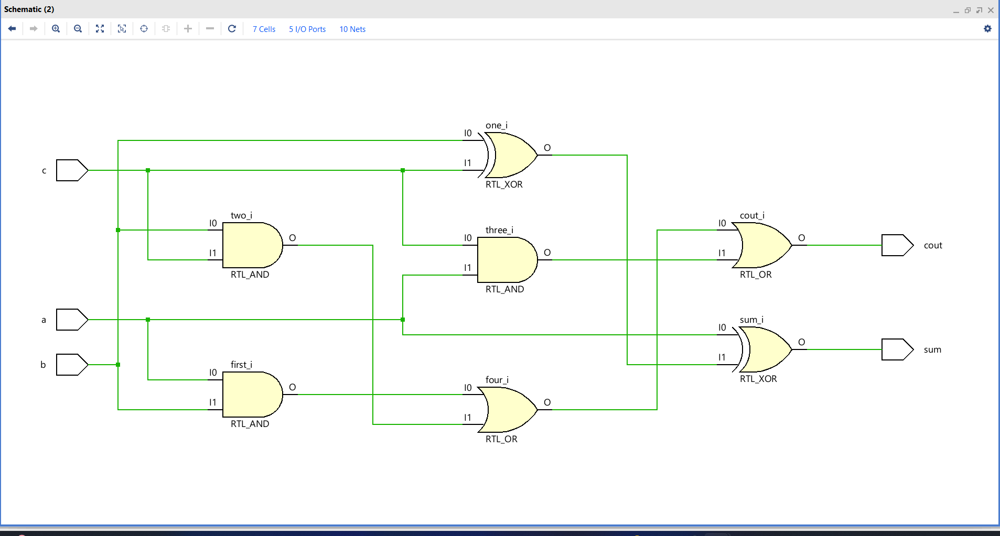
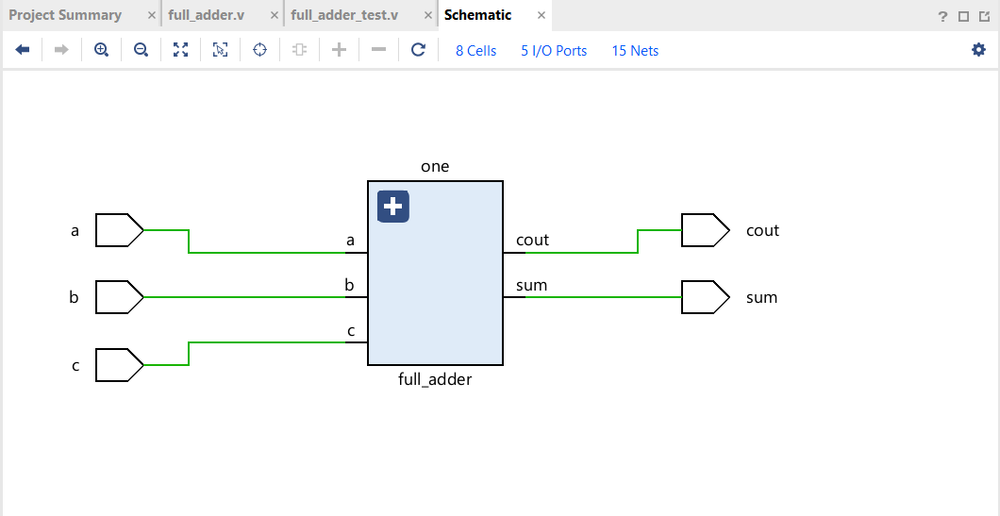
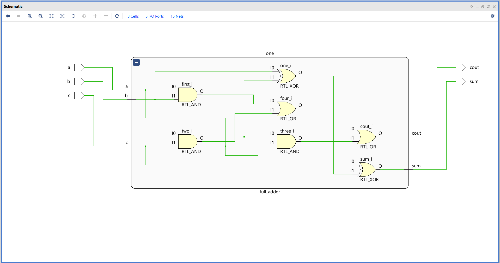
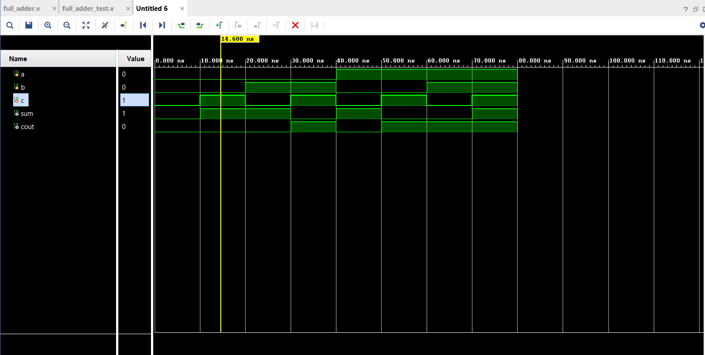

# 📘 Verilog 100 Days – Waveform and Explanation Gallery

This document shows the waveform results and brief explanations of full adder design.

---

## ✅ Day 01 – full adder (All Modeling Styles)

 

**Description:**  
 the full adder with gate level , beBehavioral , data flow has same schematic

###  Structural Modeling

###  Structural Description

**Description:**  
 the full adder with structural flow.

---

### 🔬 Simulation Result

**Description:**  
simulation results.

