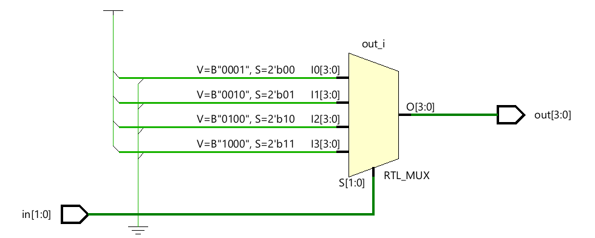

# 📘 Verilog 100 Days – Waveform and Explanation Gallery

This document shows the waveform results and brief explanations of  encoder

---

## ✅ Day 10 - encoder

 

**Description:**  
  the scematic of  2:4 encoder

 
### 🔬 Simulation Result

**Description:**  
simulation results.
simualtion results of encoder.

**Description:**  
simulation results.
simualtion results of  encoder in dispaly message.
