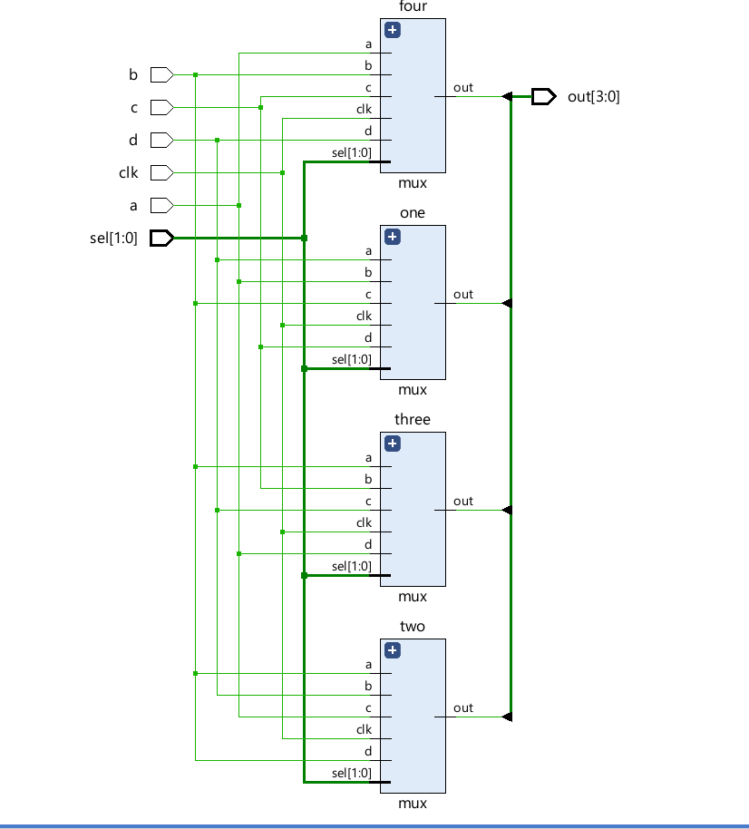
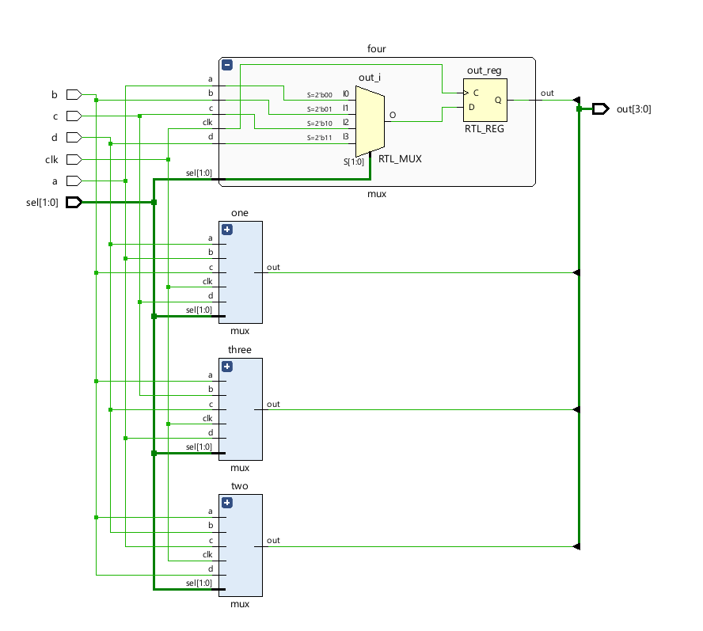
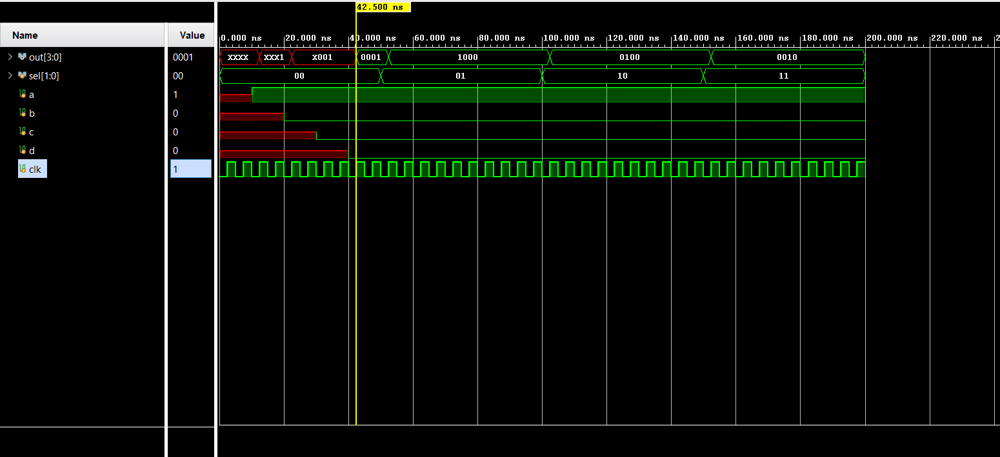

# 📘 Verilog 100 Days – Waveform and Explanation Gallery

This document shows the waveform results and brief explanations of barrel shifter.

---

## ✅ Day 11 - barrel shifter

 

**Description:**  
  the scematic of barrel shifter

###  full Modeling

**Description:** 
  the full adder scematic for barrel shifter

### 🔬 Simulation Result

**Description:**  
simulation results - 
simualtion results of barrel shifter
