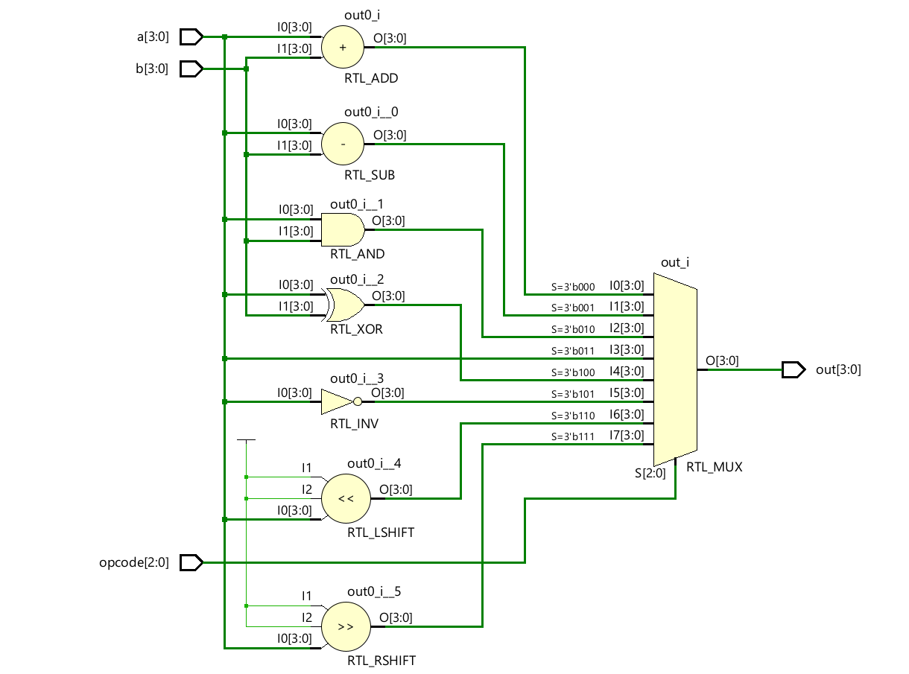
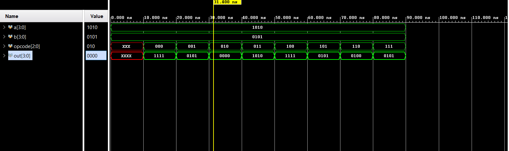

# 📘 Verilog 100 Days – Waveform and Explanation Gallery

This document shows the waveform results and brief explanations of Arithmetic Logic Unit

---

## ✅ Day 12 -  Arithmetic Logic Unit

 

**Description:**  
  the scematic of 4-bit Arithmetic Logic Unit

### 🔬 Simulation Result

**Description:**  
simulation results.
simualtion results of Arithmetic Logic Unit
