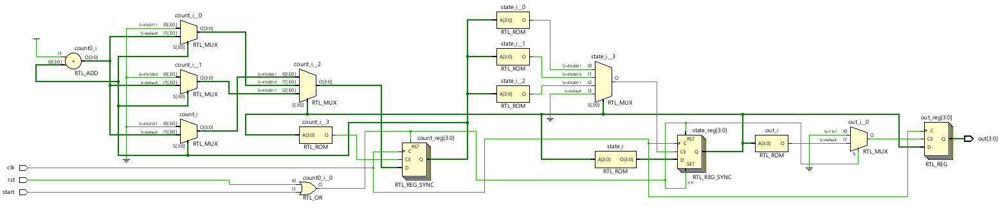
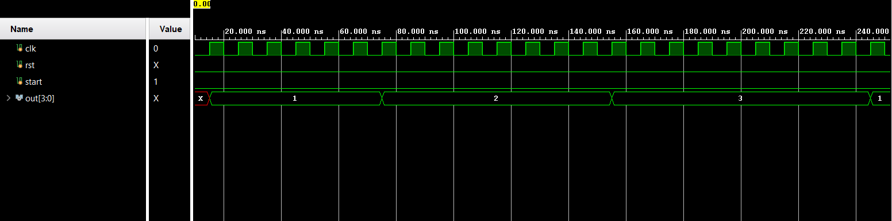

# 📘 Verilog 100 Days – Waveform and Explanation Gallery

This document shows the waveform results and brief explanations of fsm using counter for traffic light.

---

## ✅ Day 14 -  designed a fsm using counter for traffic light

 

**Description:**  
  the scematic of fsm using counter for traffic light.

 

### 🔬 Simulation Result

**Description:**  
simulation results.
simualtion results of fsm using counter for traffic light.
