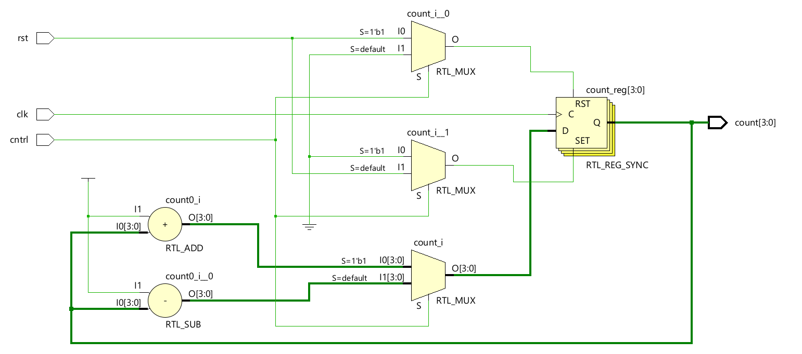
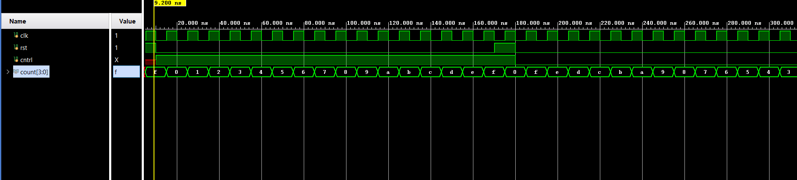

# 📘 Verilog 100 Days – Waveform and Explanation Gallery

This document shows the waveform results and brief explanations of up down counter using control.

---

## ✅ Day 16 -  up down counter using control

 

**Description:**  
  the scematic of up down counter using control

 

### 🔬 Simulation Result

**Description:**  
simulation results.
simualtion results of up down counter using control

