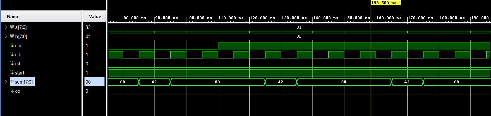
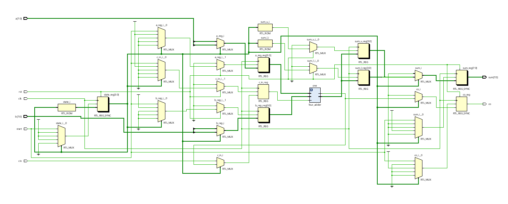

# 📘 Verilog 100 Days – Waveform and Explanation Gallery

This document shows the waveform results and brief explanations of 8 bit adder using only one 4 bit adder  

---

## ✅ Day 17 - 8 bit adder using only one 4 bit adder  

 

**Description:**  
  the scematic of 8 bit adder using only one 4 bit adder  

  
**Description:**  
it uses temporary register to store the upper vlaues and lower values at different clock cycles
that is at first clock cycle the lower bit will add 
and at second clock cycle the upper bit will add

 

### 🔬 Simulation Result

**Description:**  
simulation results.
simualtion results of 8 bit adder using only one 4 bit adder  
