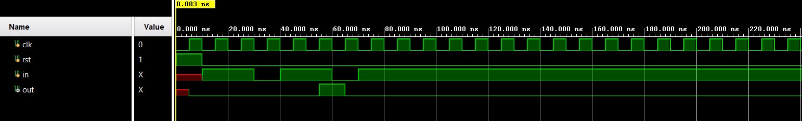

# 📘 Verilog 100 Days – Waveform and Explanation Gallery

This document shows the waveform results and brief explanations of moore model with overlapping and non-overlapping
---

## ✅ Day 18 - moore model with overlapping and non-overlapping

 ###non-overlapping

**Description:**  
  the scematic of  moore model with non-overlapping

###  overlapping

**Description:** 
 the scematic of moore model with overlapping 

### 🔬 Simulation Result

### non-overlapping simulation

**Description:**  
simulation results.
simualtion results of moore model non-overlapping

### overlapping simulation

**Description:**  
simulation results.
simualtion results of moore model overlapping
