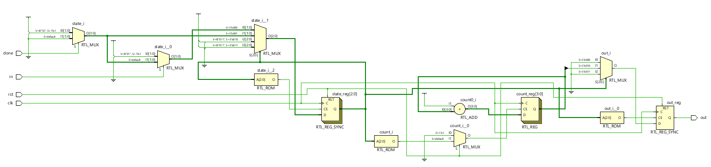
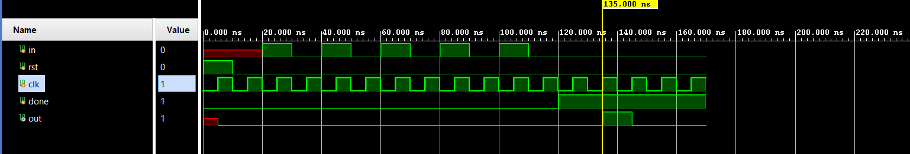

# 📘 Verilog 100 Days – Waveform and Explanation Gallery

This document shows the waveform results and brief explanations of  parity_checker for number of 1's
---

## ✅ Day 18 - parity_checker for one 

 

**Description:**  
  the scematic of parity_checker for one   

 

### 🔬 Simulation Result

### non-overlapping simulation

**Description:**  
simulation results.
simualtion results of parity_checker for one   

### overlapping simulation

**Description:**  
simulation results.
simualtion results of moore model overlapping
