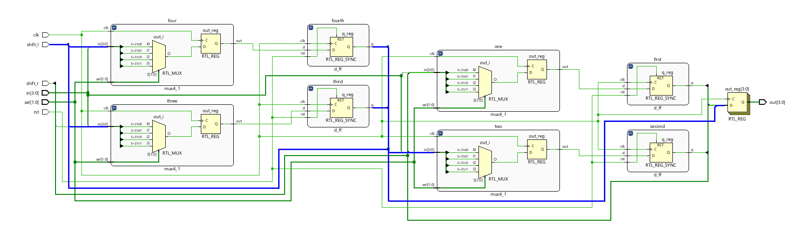
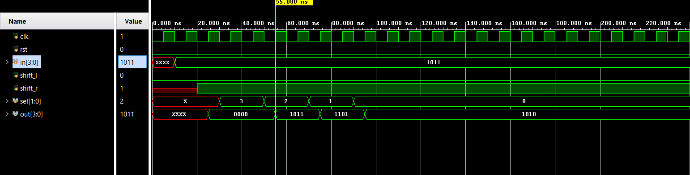

# 📘 Verilog 100 Days – Waveform and Explanation Gallery

This document shows the waveform results and brief explanations of  universal shift register
---

## ✅ Day 21 - universal shift register 

 

**Description:**  
  the scematic of universal shift register

 

### 🔬 Simulation Result

 **Description:**  -  
 in this simulation  we see that 4:1 mux with 2 select line  
 4th line - parallel load  
 3rd line - shift right  
 2nd line - shift left  
 1st line - hold value  
 

**Description:**  
simulation results.
simualtion results of universal shift register 
 
