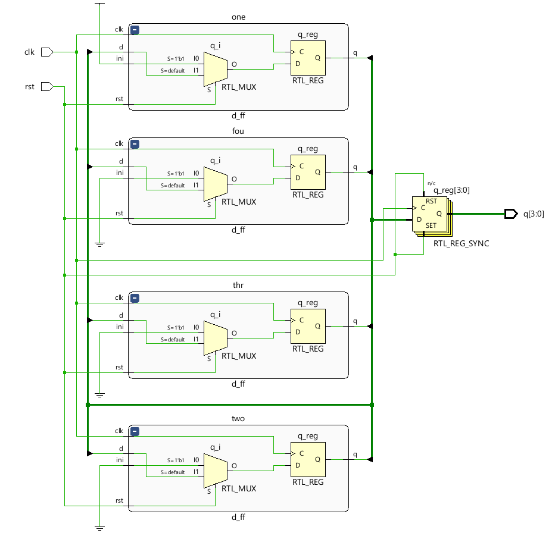
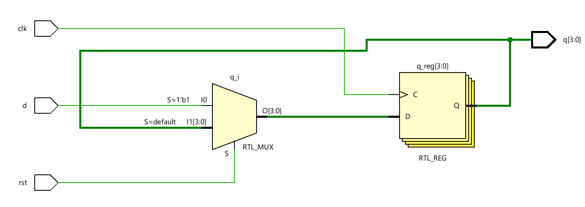
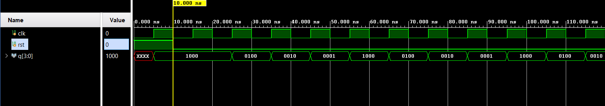
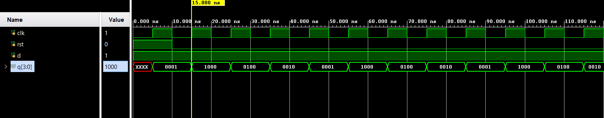

# 📘 Verilog 100 Days – Waveform and Explanation Gallery

This document shows the waveform results and brief explanations of  ring counter

---

## ✅ Day 22 - ring counter

 

**Description:**  
  the scematic of ring counter with structral model

###  full Modeling

**Description:** 
  the scematic for  ring counter with behavioral model

### 🔬 Simulation Result

**Description:**  
simulation results - 
simualtion results of ring counter with structral model

**Description:**  
simulation results - 
simualtion results of ring counter with behavioral model

