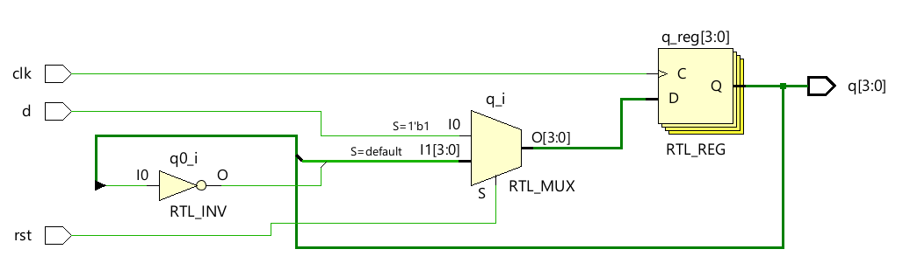
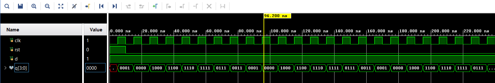

# 📘 Verilog 100 Days – Waveform and Explanation Gallery

This document shows the waveform results and brief explanations of  johnson counter

---

## ✅ Day 23 - johnson counter

 

**Description:**  
  the scematic of  johnson counter

 
 
 

 
 
### 🔬 Simulation Result

**Description:**  
simulation results.
simualtion results  johnson counter
