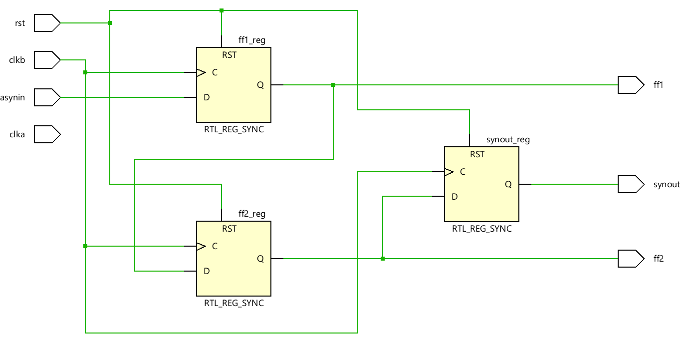
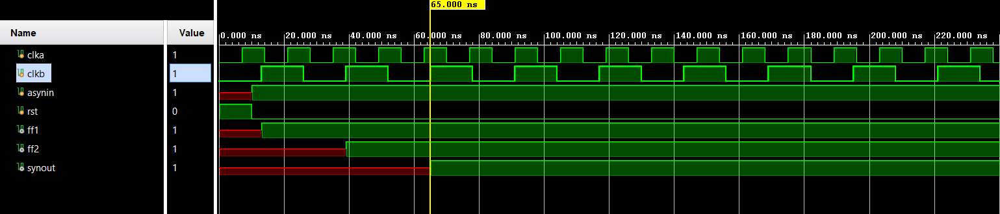

# 📘 Verilog 100 Days – Waveform and Explanation Gallery

This document shows the waveform results and brief explanations of synchronizer between two asynchronous clock domains.

---

## ✅ Day 24 - synchronizer between two asynchronous clock domains.

 

**Description:**  
  the scematic of synchronizer between two asynchronous clock domains.

 

### 🔬 Simulation Result

**Description:**  
simulation results - 
simualtion results ofsynchronizer between two asynchronous clock domains.
