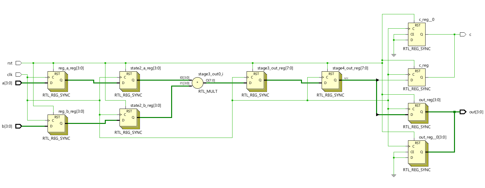
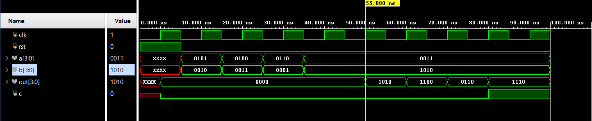

# 📘 Verilog 100 Days – Waveform and Explanation Gallery

This document shows the waveform results and brief explanations of Design of a Pipelined Multiplier (4-bit x 4-bit)

---

## ✅ Day 25 - Design of a Pipelined Multiplier (4-bit x 4-bit)

 

**Description:**  
  the scematic of  Pipelined Multiplier  

 

### 🔬 Simulation Result

**Description:**  
simulation results - 
simualtion results of a Pipelined Multiplier  
