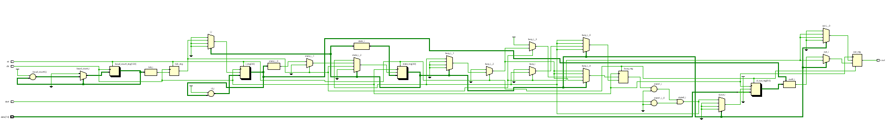
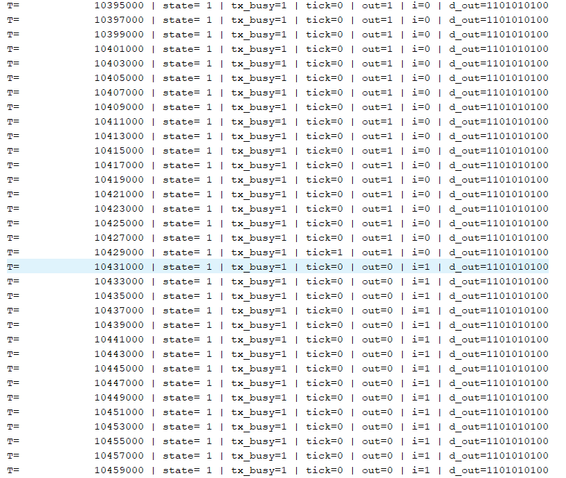
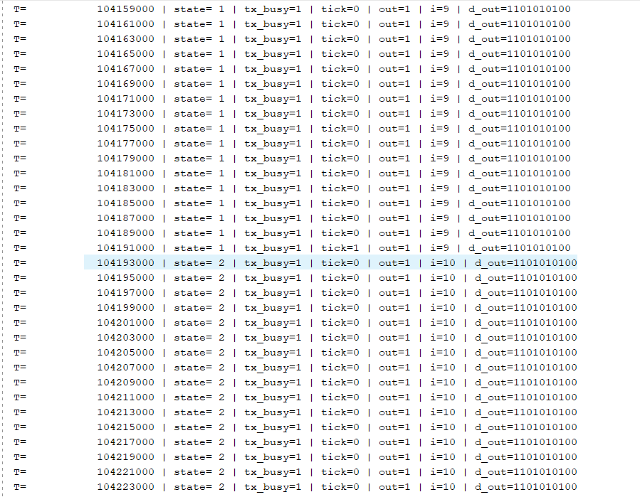
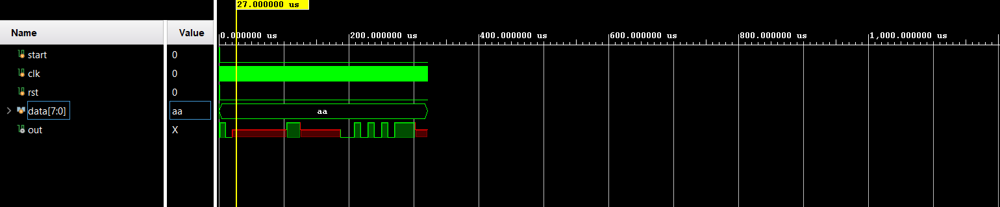
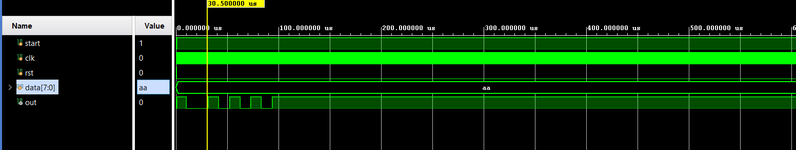

# 📘 Verilog 100 Days – Waveform and Explanation Gallery

This document shows the waveform results and brief explanations of   uart_transmitter
---

## ✅ Day 26 - uart_transmitter

 

**Description:**  
  the scematic of  uart_transmitter

**Description:**  
 here we can see that for buad rate of 9600.
 for 50MHz frequency and timescale of 1ns
 we get 104.66 us for one tick(for one bit to send).
 meaning  
tick_period = (1 / 9600) seconds = 104.166 us
 
clock_period = 1 / 50,000,000 = 20 ns 
ticks_needed = 104.166 µs / 20 ns = 5208 clock cycles 

**Description:**  
 here we can see that for buad rate of 9600.
 for 50MHz frequency and timescale of 1ns
 we get 104.66 us for one tick(for one bit to send).

 so it becomes ~ 1040(approximatly) us , to send the 10 bit data

### 🔬 Simulation Result

understanding of simulation of uart and wrting of simulation code.

the simlation code there some understanding of the code.
first when u write teh data after start 
it will show x after data is triggered , because when start is triggered there is no data to show
so 
//initial begin
//start=1;
//rst = 1;
//#10;
//rst=0;
//#5;
//start = 0;#5;
//data = 8'b10101010;#20;
////$finish;
//end

here wrong behavior of uart will shown

**Description:**  
simulation results.
simualtion results of uart with data being written after start.

 

//initial begin
//start=1;
//rst = 1;
//#10;
//rst=0;
//#5;
//start = 0;#5;
//data = 8'b10101010;#20;
//(here start should be 1 again or else it is show x because after start #5 there is nothing that drives the start so start becomes x)
//start =1; 
////$finish;
//end

now after data initialze at first and now if we not reinitalized the start bit to 1 after data is transferred that is after 10 bit is transferred it will show x, because as start is reg type now it is not driven by anything so after transfer it will show x.

**Description:**  
  the scematic of  uart simulation being written without start bit.

 
 
### 🔬 Simulation Result

initial begin
    rst = 1;
    start = 1;
    data = 8'b10101010;
    #10 rst = 0;
    #20 start = 0;
    #2  start = 1; // hold start low for just one cycle
    #10000; // wait for output to complete
    $finish;
end

**Description:**  
simulation results.
simualtion results  the correct uart simuation code 
