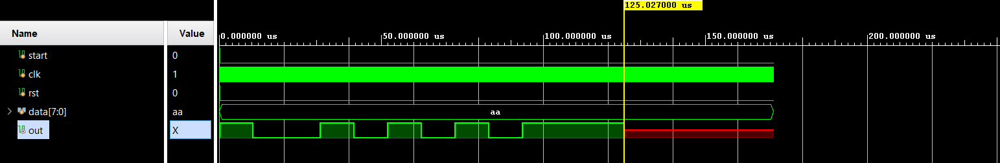

# 📘 Verilog 100 Days – Waveform and Explanation Gallery

This document shows waveform results and brief explanations for the uart_transmitter module.

---

## ✅ Day 26 – uart transmitter

---

### Schematic


**Description:**  
Schematic representation of the `uart_transmitter` module showing the logic of serial transmission using UART protocol.

---

### ⏱️ Timing Breakdown


**Description:**  
To transmit at **9600 baud** using a **50 MHz** clock:

- **tick_period** = `1 / 9600` = `104.166 µs`
- **clock_period** = `1 / 50,000,000` = `20 ns`
- **ticks_needed** = `104.166 µs / 20 ns` = **5208 clock cycles**

> So, to send 10 bits (1 start + 8 data + 1 stop), it takes:  
> `10 * 104.166 µs = ~1041.66 µs`

---


**Description:**  
You can observe that the transmission of all 10 bits completes in **~1040 µs**, which aligns well with the expected baud rate of **9600**.

---

## 🔬 Simulation Results

---

### Incorrect – Data Written *After* Start


```verilog
initial begin
    start = 1;
    rst = 1;
    #10 rst = 0;
    #5 start = 0;
    #5 data = 8'b10101010; // Too late!
end
```

**Description:**  
Here, the `start` signal is pulled low **before** the `data` is assigned.  
As a result, the UART samples incorrect or unknown (`x`) values, producing invalid transmission.

---

###  Incorrect – Start Not Reasserted



```verilog
initial begin
    start = 1;
    rst = 1;
    #10 rst = 0;
    #5 start = 0;
    #5 data = 8'b10101010;
    #20;
    // Missing: start = 1; // Line goes undriven after reset
end
```

**Description:**  
After `start = 0`, it’s never set back to `1`.  
Since `start` is a `reg`, the simulator expects it to be continuously driven.  
After a while, the line becomes `x` (undefined) and breaks functionality.

---

### ✅ Correct – Data Before Start Pulse


```verilog
initial begin
    rst = 1;
    start = 1;
    data = 8'b10101010;
    #10 rst = 0;
    #20 start = 0;   // Pulse to trigger UART
    #2  start = 1;   // Return to idle
    #10000;
    $finish;
end
```

**Description:**  
This is the **correct sequence**:
- Assign `data` first.
- Pulse `start` low briefly to trigger the transmission.
- Return `start` to `1` to idle the line.

> This results in correct 10-bit transmission (start + 8 data + stop) at the desired baud rate.

---

## 📎 Notes

- UART line idle state is logic high (`1`)
- Start bit is logic low (`0`)
- Data is LSB first
- Stop bit is logic high (`1`)
- `tick` is generated every 5208 clock cycles for 9600 baud with 50 MHz system clock
 
