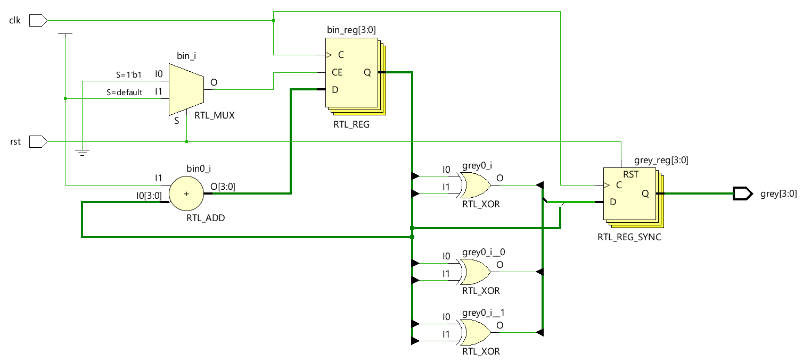
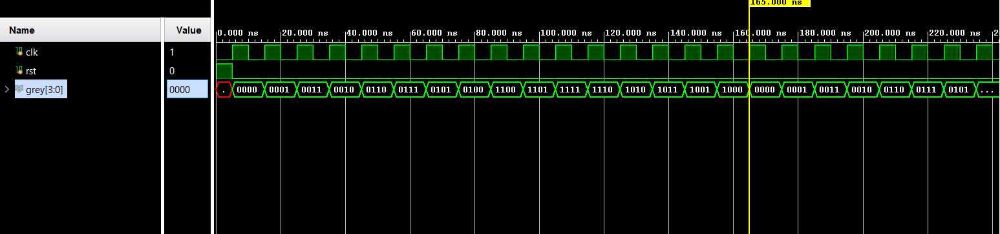
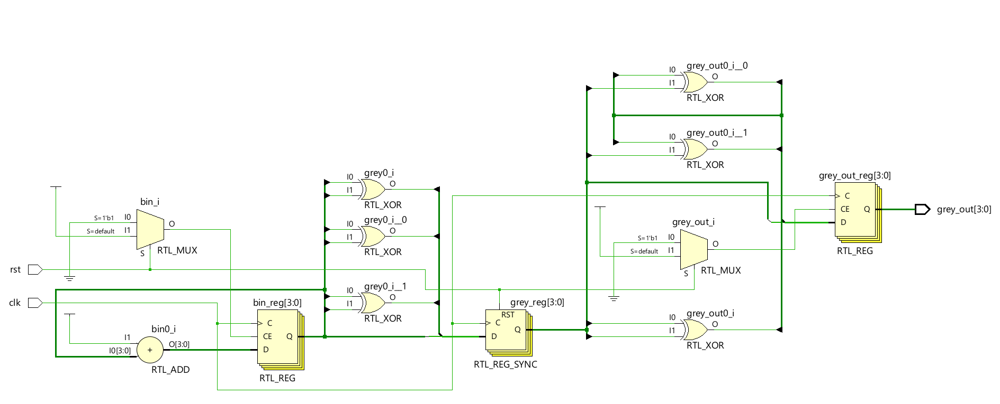
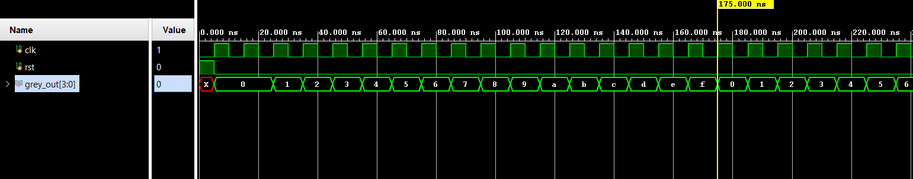

# 📘 Verilog 100 Days – Waveform and Explanation Gallery

This document shows the waveform results and brief explanations of  real time binary to grey converter and vice versa

---

## ✅ Day 27 -  real time binary to grey converter and vice versa

 

**Description:**  
  the scematic of  binary to grey converter

 
### 🔬 Simulation Result

**Description:**  
simulation results.
simualtion results of binary to grey converter

 
 

**Description:**  
  the scematic of  grey to binary
 
### 🔬 Simulation Result

**Description:**  
simulation results.
simualtion results   grey to binary
