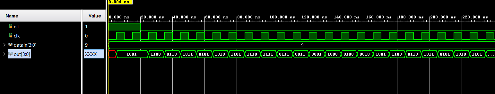

# 📘 Verilog 100 Days – Waveform and Explanation Gallery

This document shows the waveform results and brief explanations of linear feedback shift register (LFSR)

---

## ✅ Day 28 – linear feedback shift register (LFSR)

 

**Description:**  
  the scematic of linear feedback shift register (LFSR)
 
---

### 🔬 Simulation Result

**Description:**  
simulation results of linear feedback shift register (LFSR)
