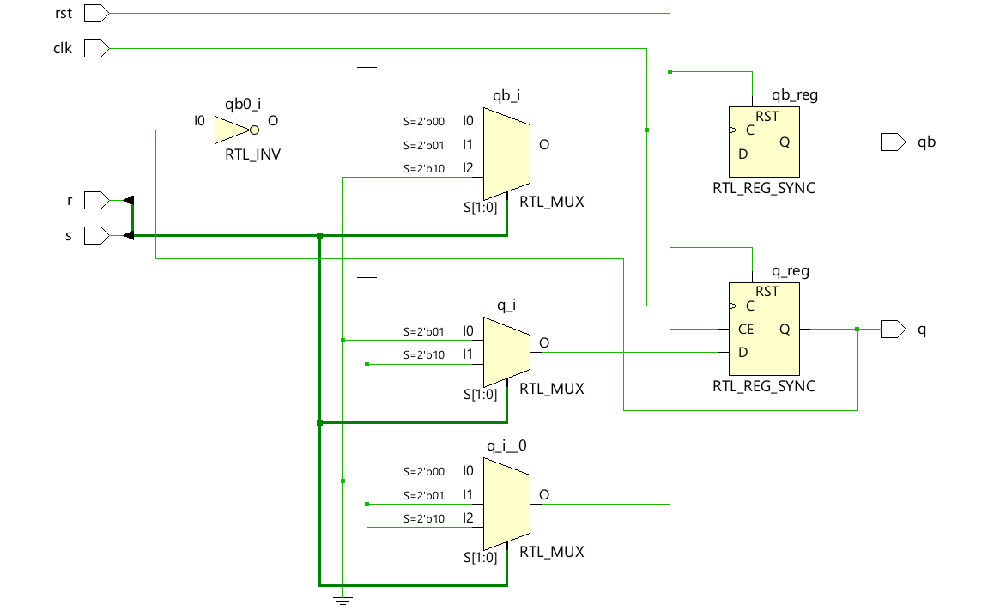
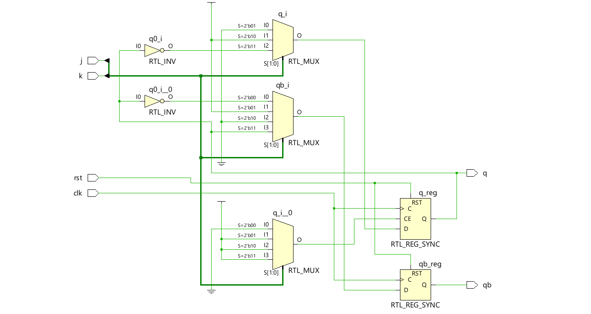
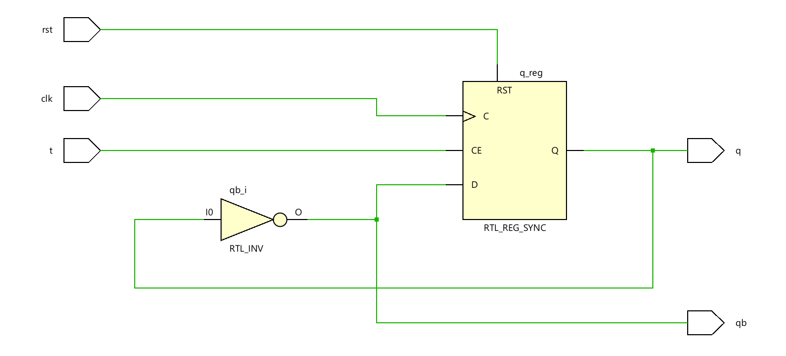
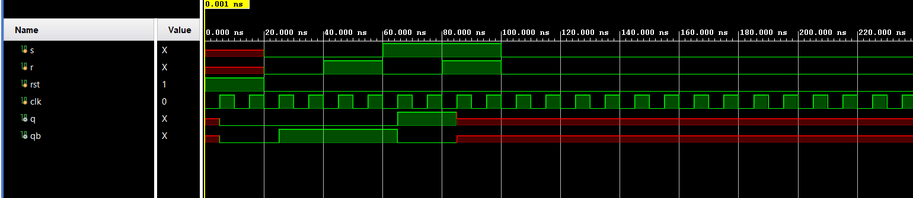
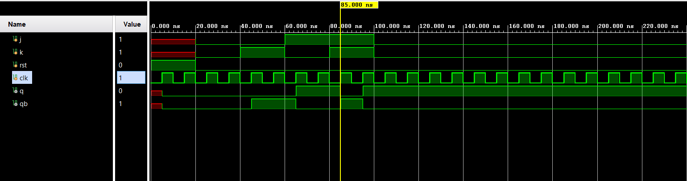

# 📘 Verilog 100 Days – Waveform and Explanation Gallery

This document shows the waveform results and brief explanations of flipflops

---

## ✅ Day 29 – flipflops

 

**Description:**  
 the schematic of sr flipflop

###  Structural Description

**Description:**  
 the schematic of jk flipflop

 ###  Structural Description

**Description:**  
 the schematic of T flipflop

---

### 🔬 Simulation Result

**Description:**  
simulation results of sr_ff

**Description:**  
simulation results of jk_ff

**Description:**  
simulation results of T_ff
