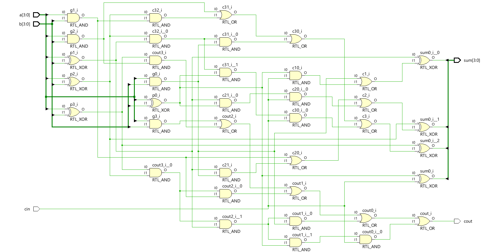
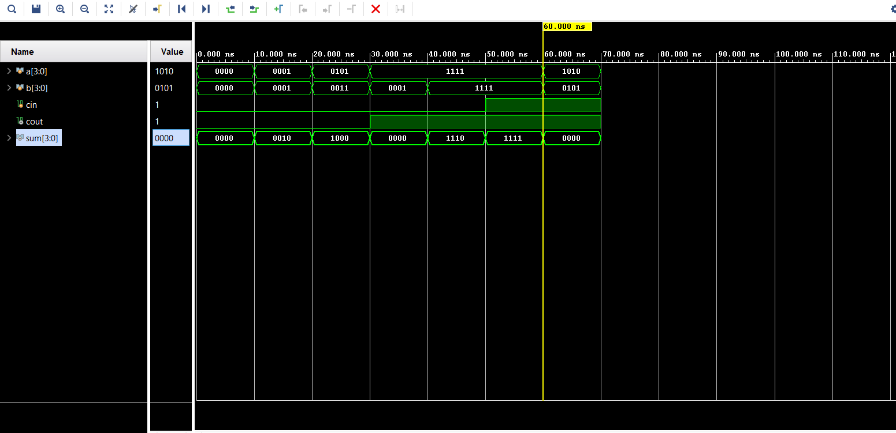

# 📘 Verilog 100 Days – Waveform and Explanation Gallery

This document shows the waveform results and brief explanations of ripple carry adder design.

---

## ✅ Day 02 - ripple carry adder

 

**Description:**  
  the scematic of 4bit  carry look ahead adder

 

### 🔬 Simulation Result

**Description:**  
  simulation results.
  simualtion results of carry look ahead adder
