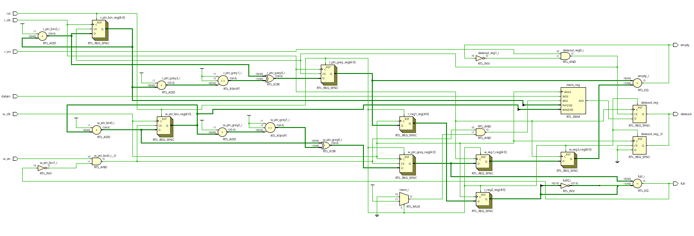
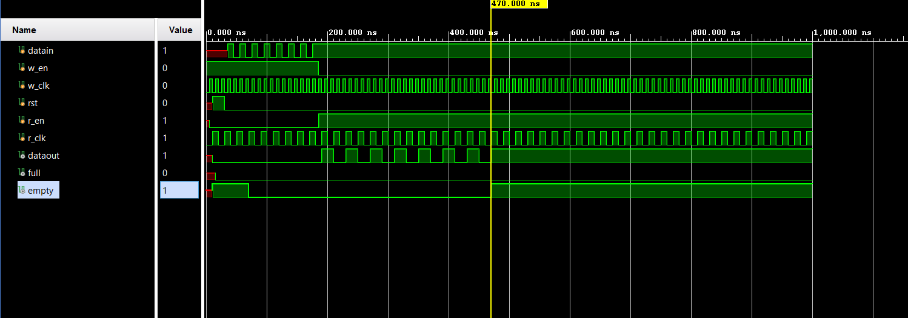

# 📘 Verilog 100 Days – Waveform and Explanation Gallery

This document shows the waveform results and brief explanations of asynchronous fifo

---

## ✅ Day 30 – asynchronous fifo

 

**Description:**  
 the scematic of asynchronous fifo

  

---

### 🔬 Simulation Result

**Description:**  
simulation results of async fifo.
