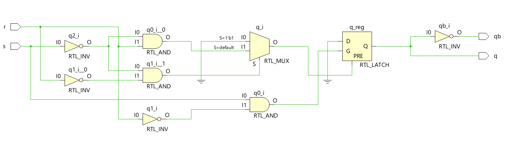
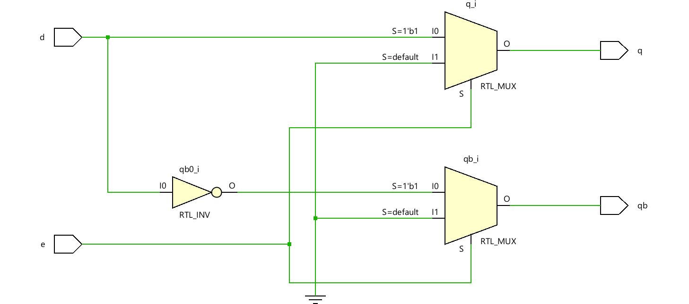
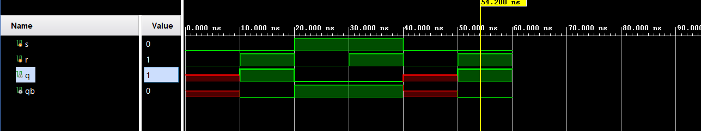
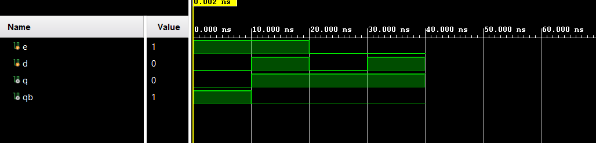

# 📘 Verilog 100 Days – Waveform and Explanation Gallery

This document shows the waveform results and brief explanations of Latch using combinational logic
---

## ✅ Day 31 –  Latch using combinational logic
 

**Description:**  
 the full adder with gate level , beBehavioral , data flow has same schematic

###  Structural Modeling

 

### 🔬 Simulation Result

**Description:**  
simulation results of d latch

**Description:**  
simulation results of d latch
