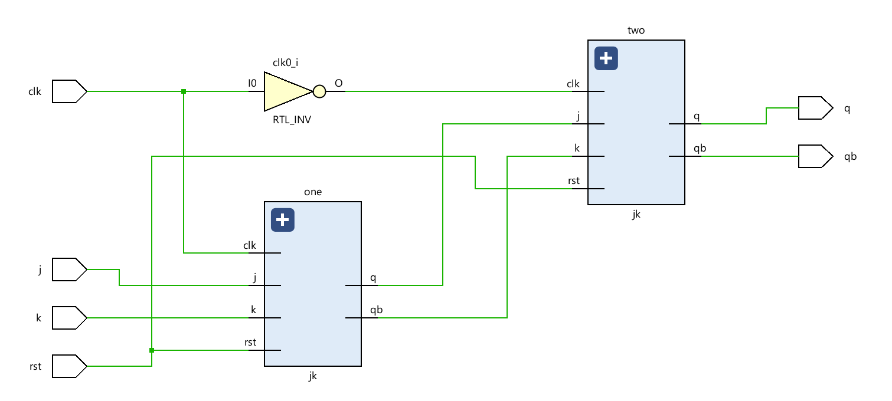

# 📘 Verilog 100 Days – Waveform and Explanation Gallery

This document shows the waveform results and brief explanations of  master slave using jk flip flop

---

## ✅ Day 32 –  master slave using jk flip flop

 

**Description:**  
 master slave using jk flip flop

 

**Description:**  
 the schematic of master slave using jk flip flop
 

---

### 🔬 Simulation Result

**Description:**  
simulation results master slave using jk flip flop
