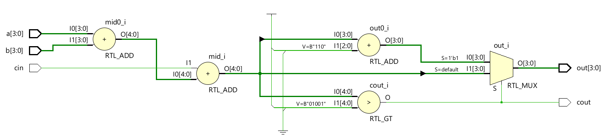
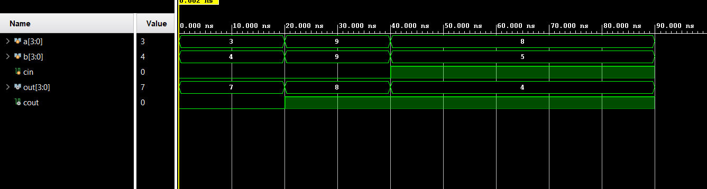

# 📘 Verilog 100 Days – Waveform and Explanation Gallery

This document shows the waveform results and brief explanations of  bcd adder
---

## ✅ Day 33 -  bcd adder
 

**Description:**  
  the scematic of  bcd adder

 
### 🔬 Simulation Result

**Description:**  
simulation results.
simualtion results of bcd adder

 
