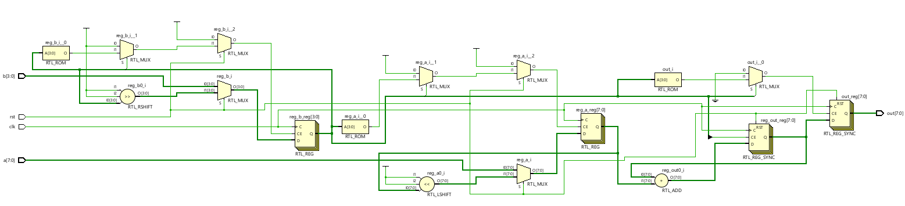
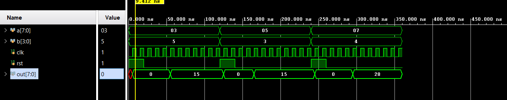

# 📘 Verilog 100 Days – Waveform and Explanation Gallery

This document shows the waveform results and brief explanations of   shift and add mulitiplier

---

## ✅ Day 34 -  shift and add mulitiplier

 

**Description:**  
  the scematic of  shift and add multiplier

 
### 🔬 Simulation Result

**Description:**  
simulation results.
simualtion results of shift and add multiplier

 
