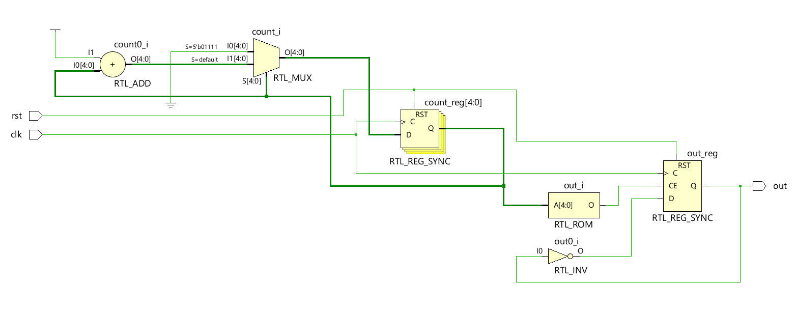

# 📘 Verilog 100 Days – Waveform and Explanation Gallery

This document shows the waveform results and brief explanations of  clock divider

---

## ✅ Day 35 - clock divider

 **Description:**  
We observe that the clock divider produces an output with a 50% duty cycle.

**Description:**  
  the scematic of clock divider

 

### 🔬 Simulation Result

**Description:**  
simulation results - 
simualtion results of  clock divider
