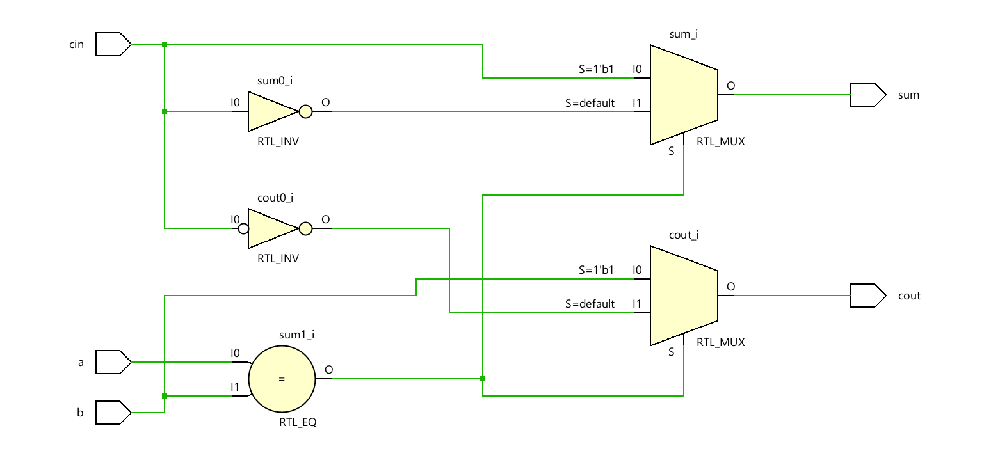

# 📘 Verilog 100 Days – Waveform and Explanation Gallery

This document shows the waveform results and brief explanations of adder using mux

---

## ✅ Day 36 - full adder using mux

 **Description:**  
 This is based on truth table observation of full adder using only inputs to connect the output

**Description:**  
  the scematic of  full adder using mux

 

### 🔬 Simulation Result

 

**Description:**  
simulation results - 
simualtion results of full adder using mux
