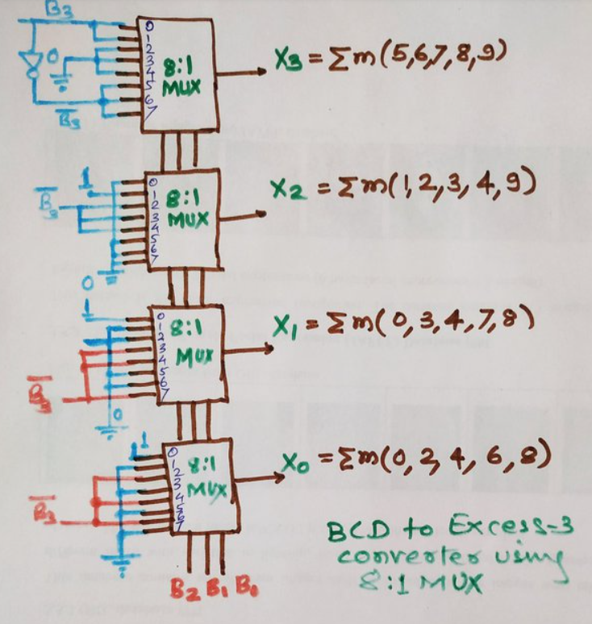
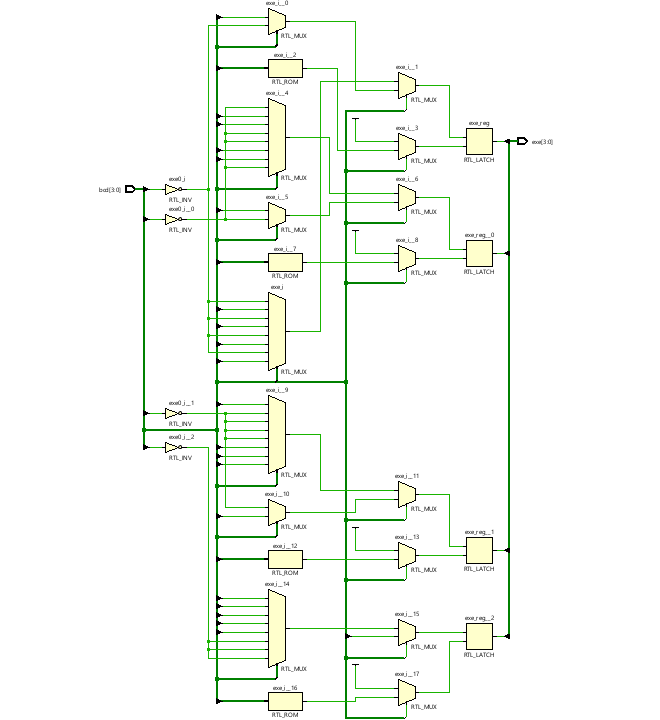
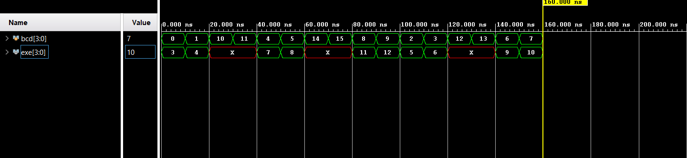

# 📘 Verilog 100 Days – Waveform and Explanation Gallery

This document shows the waveform results and brief explanations of bcd to excess-3 using 8:1 mux

---

## ✅ Day 37 -  bcd to excess-3 using 8:1 mux

 

**Description:**  
  this is the refference image of bcd to excess-3 using mux 8:1

###  full Modeling

**Description:** 
  the  scematic for bcd to excess-3 using 8:1 mux

### 🔬 Simulation Result

**Description:**  
simulation results - 
simualtion results of bcd to excess-3 using 8:1 mux
