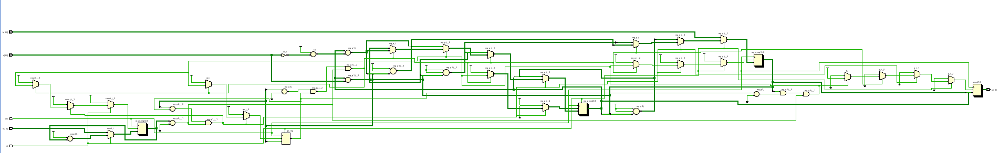
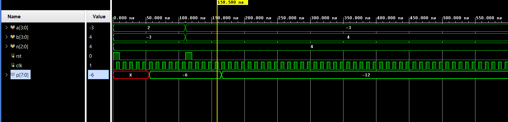

# 📘 Verilog 100 Days – Waveform and Explanation Gallery

This document shows the waveform results and brief explanations of Booth Multiplier

---

## ✅ Day 38 - Booth Multiplier

 

**Description:**  
  the scematic of Booth Multiplier

### 🔬 Simulation Result

**Description:**  
simulation results.
simualtion results of Booth Multiplier
