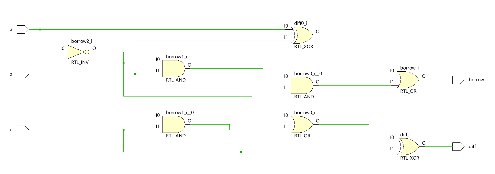
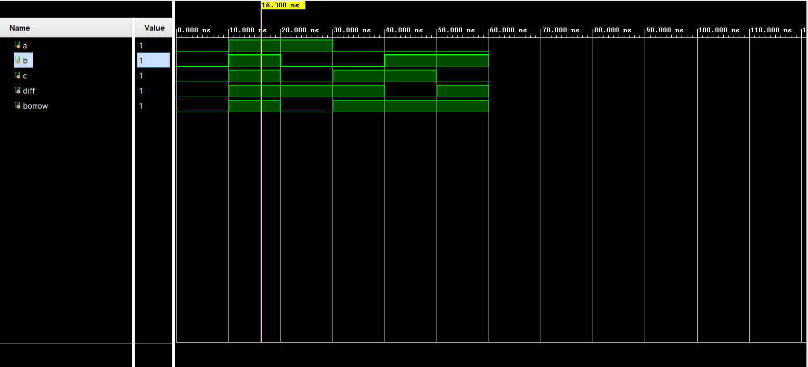

# 📘 Verilog 100 Days – Waveform and Explanation Gallery

This document shows the waveform results and brief explanations of full subtractor.

---

## ✅ Day 04 - full subtractor
 

**Description:**  
  the scematic of  full subtractor

 

### 🔬 Simulation Result

**Description:**  
  simulation results.
  simualtion results of full subtractor
