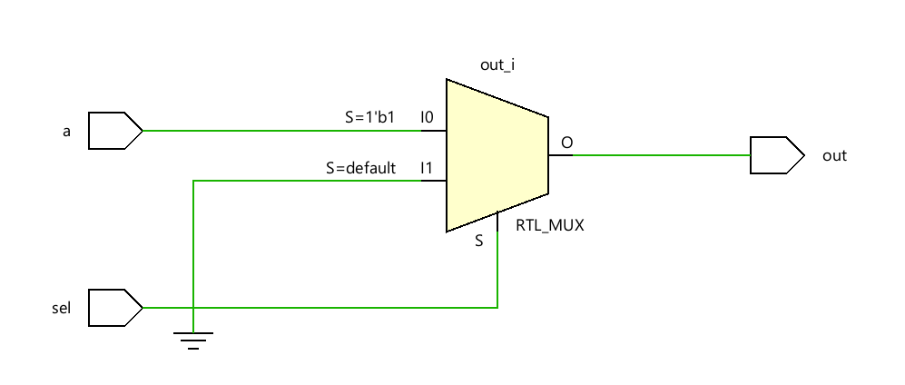
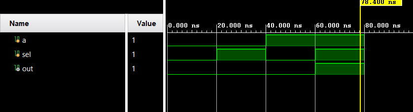

# 📘 Verilog 100 Days – Waveform and Explanation Gallery

This document shows the waveform results and brief explanations of and gate using mux

---

## ✅ Day 39 – and gate using mux

 

**Description:**  
the schematic of and gate using mux

 
---

### 🔬 Simulation Result

**Description:**  
simulation results of and gate using mux
 
