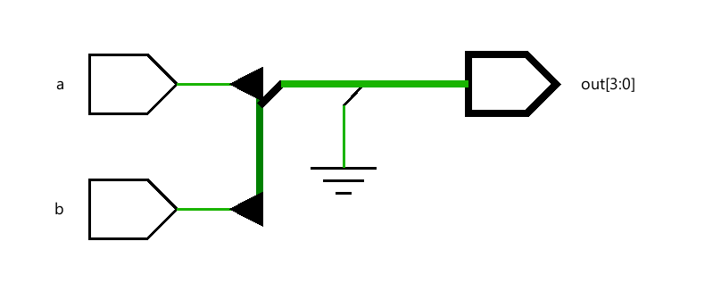
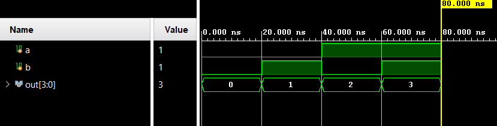

# 📘 Verilog 100 Days – Waveform and Explanation Gallery

This document shows the waveform results and brief explanations of or gate using decoder

---

## ✅ Day 41 – or gate using decoder

 

**Description:**  
the schematic of or gate using decoder

 
---

### 🔬 Simulation Result

**Description:**  
simulation results of or gate using decoder
 
