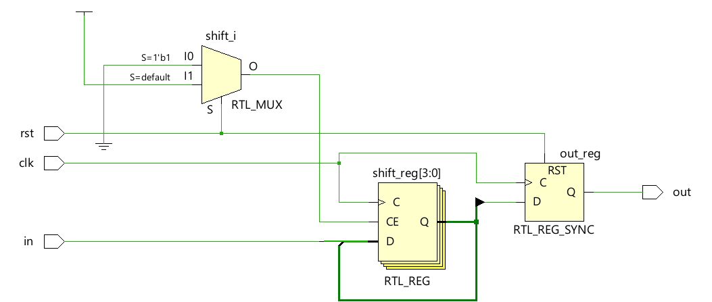
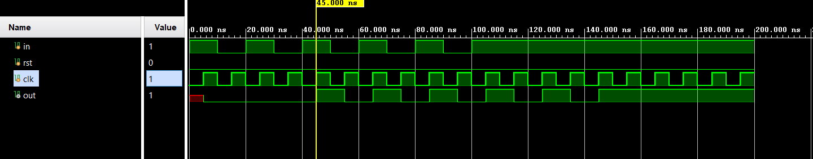

# 📘 Verilog 100 Days – Waveform and Explanation Gallery

This document shows the waveform results and brief explanations of siso (serial in serial out)

---

## ✅ Day 43 –  siso(serial in serial out)

 

**Description:**  
 The full schematic of  siso(serial in serial out)
---

### 🔬 Simulation Result

**Description:**  
simulation results.
