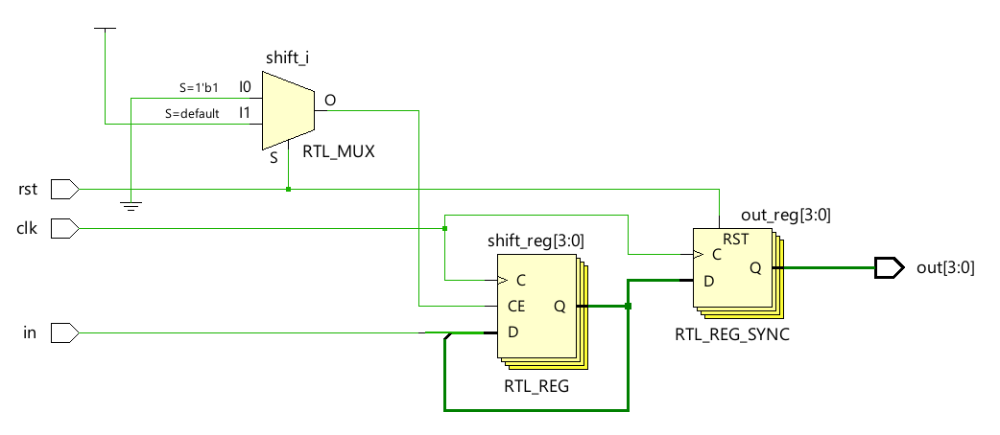
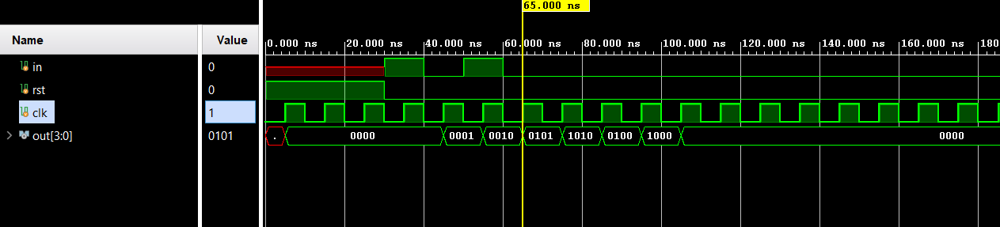

# 📘 Verilog 100 Days – Waveform and Explanation Gallery

This document shows the waveform results and brief explanations of sipo (serial in parallel out)

---

## ✅ Day 44 –  sipo(serial in parallel out)

 

**Description:**  
 The full schematic of  sipo(serial in parallel out)
---

### 🔬 Simulation Result

**Description:**  
simulation results.
