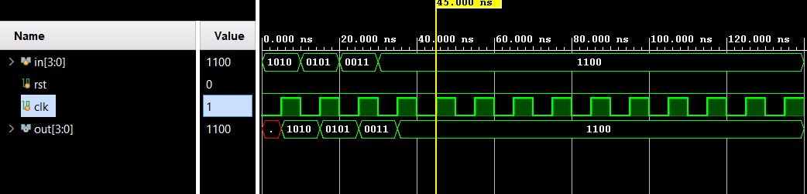

# 📘 Verilog 100 Days – Waveform and Explanation Gallery

This document shows the waveform results and brief explanations of pipo(parallel in parallel out)

---

## ✅ Day 43 –  pipo(parallel in parallel out)

 

**Description:**  
 The full schematic of  pipo(parallel in parallel out)
---

### 🔬 Simulation Result

**Description:**  
simulation results of pipo(parallel in parallel out)
