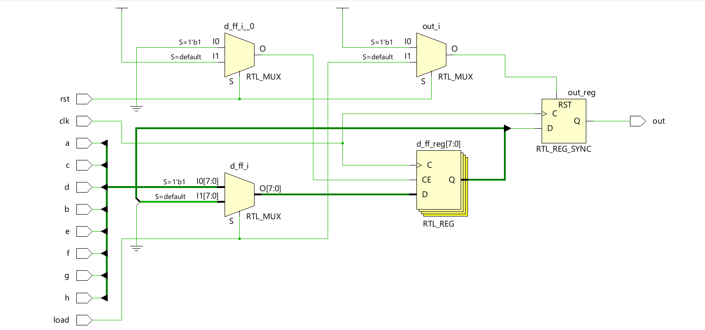
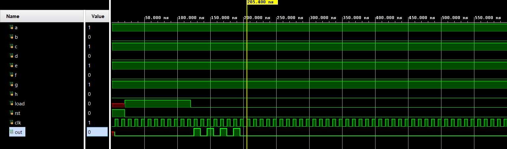

# 📘 Verilog 100 Days – Waveform and Explanation Gallery

This document shows the waveform results and brief explanations of  piso (parallel in serial out)

---

## ✅ Day 46 –  piso (parallel in serial out)

 

**Description:**  
 the full schematic of  piso (parallel in serial out)

 

---

### 🔬 Simulation Result

**Description:**  
simulation results  piso (parallel in serial out)

