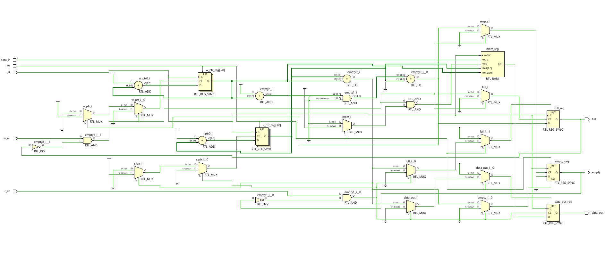
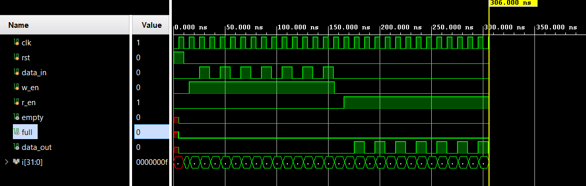

# 📘 Verilog 100 Days – Waveform and Explanation Gallery

This document shows the waveform results and brief explanations of  synchronous fifo.

---

## ✅ Day 48 –  synchronous fifo.
 

**Description:**  
The schematic of synchronous fifo.

 
---

### 🔬 Simulation Result

**Description:**  
simulation results of synchronous fifo.
