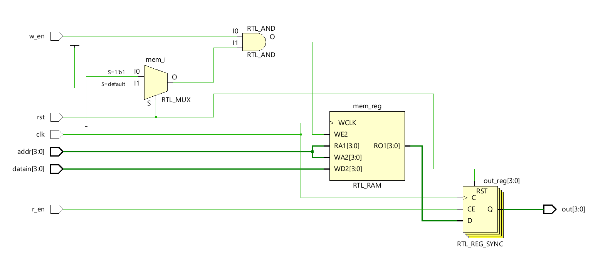
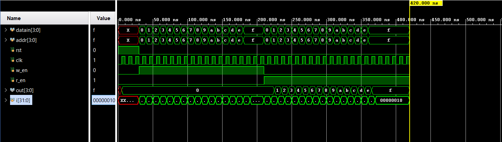

# 📘 Verilog 100 Days – Waveform and Explanation Gallery

This document shows the waveform results and brief explanations of  ram

---

## ✅ Day 49 – ram

 

**Description:**  
 The schematic of ram

 
---

### 🔬 Simulation Result

**Description:**  
simulation results of ram.
