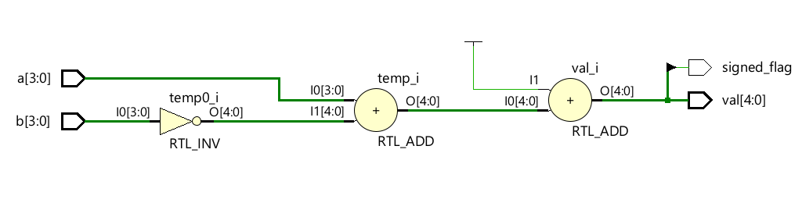
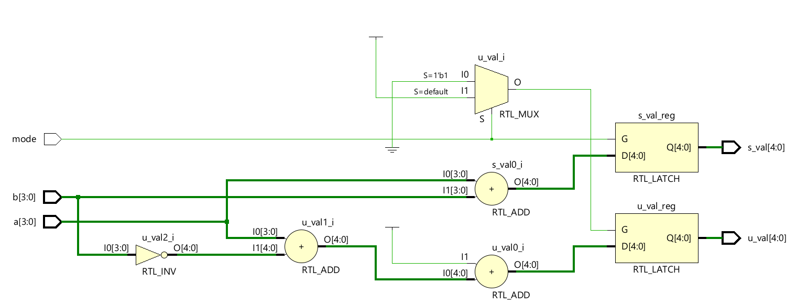
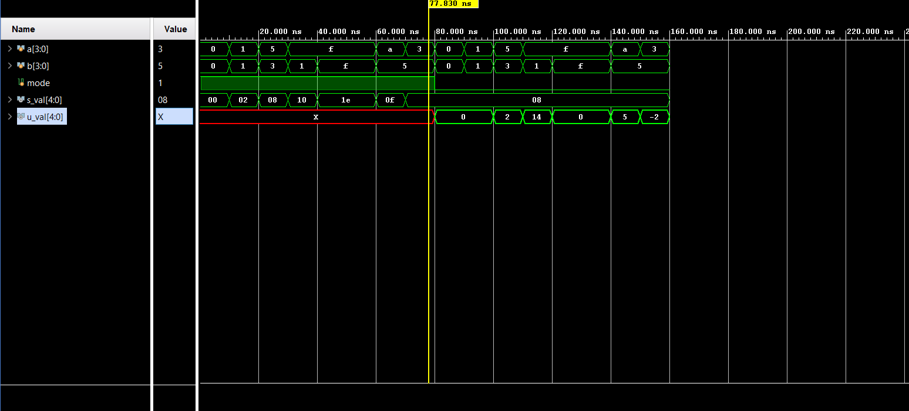
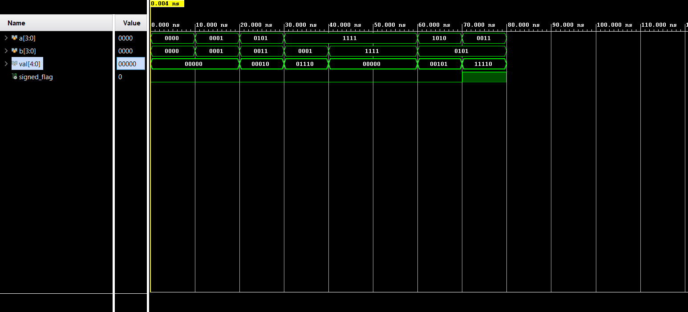

# 📘 Verilog 100 Days – Waveform and Explanation Gallery

This document shows the waveform results and brief explanations of subtractor using 2's complement design.

---

## ✅ Day 05 - subtractor using 2's complement

 

**Description:**  
  the scematic of  4-bit subtractor using 2's complement

###  full Modeling

**Description:** 
  the schematic of both signed and unsigned binary addition 

### 🔬 Simulation Result

**Description:**  
simulation results.
simualtion results of 4-bit subtractor

**Description:**  
simulation results.
simualtion results of addtion of signed and unsigned values , depending on the mode the signed and unsigned are assigned.

