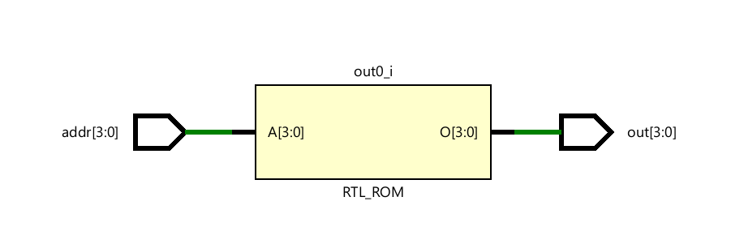
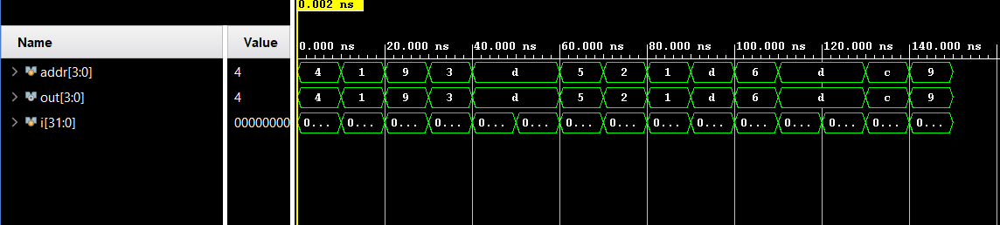

# 📘 Verilog 100 Days – Waveform and Explanation Gallery

This document shows the waveform results and brief explanations of  ROM

---

## ✅ Day 50 – ROM

 

**Description:**  
 The schematic of ROM 

 
---

### 🔬 Simulation Result

**Description:**  
simulation results of ROM.
