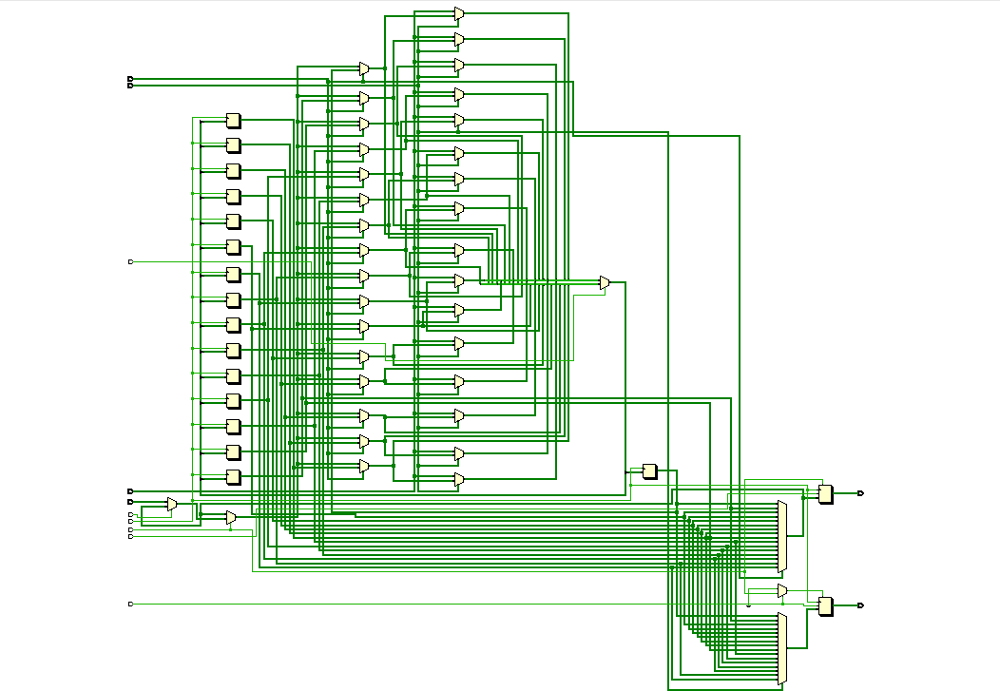
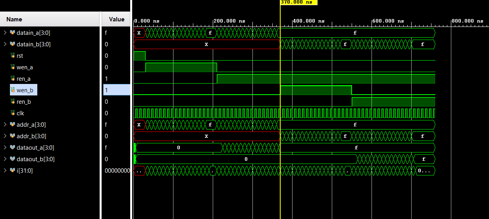

# 📘 Verilog 100 Days – Waveform and Explanation Gallery

This document shows the waveform results and brief explanations of  DUAL PORT RAM

---

## ✅ Day 51 – DUAL PORT RAM

 

**Description:**  
 The schematic of DUAL PORT RAM

 
---

### 🔬 Simulation Result

**Description:**  
simulation results of DUAL PORT RAM.
