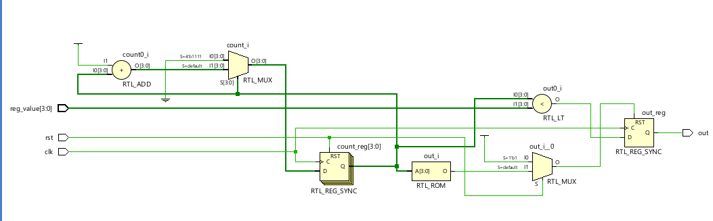

# 📘 Verilog 100 Days – Waveform and Explanation Gallery

This document shows the waveform results and brief explanations of  PWM(PULSE WIDTH MODULATION)

---

## ✅ Day 52 – PWM(PULSE WIDTH MODULATION)

 

**Description:**  
 The schematic of PWM(PULSE WIDTH MODULATION)

 
---

### 🔬 Simulation Result

**Description:**  
simulation results of PWM(PULSE WIDTH MODULATION)
