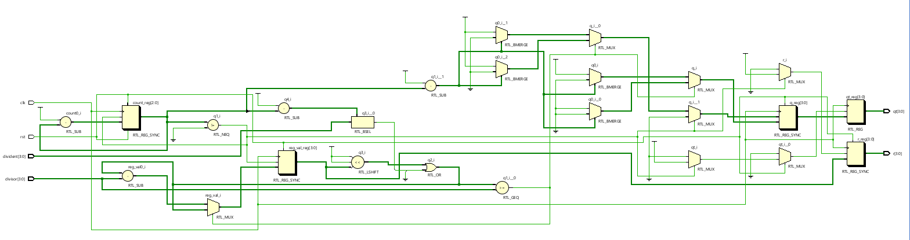
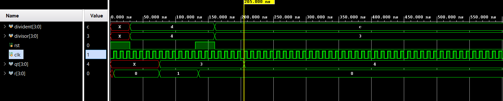

# 📘 Verilog 100 Days – Waveform and Explanation Gallery

This document shows the waveform results and brief explanations of  SIMPLE DIVIDEDR

---

## ✅ Day 53 –  SIMPLE DIVIDER

 

**Description:**  
 The schematic of SIMPLE DIVIDER
---

### 🔬 Simulation Result

**Description:**  
simulation results of SIMPLE DIVIDER
