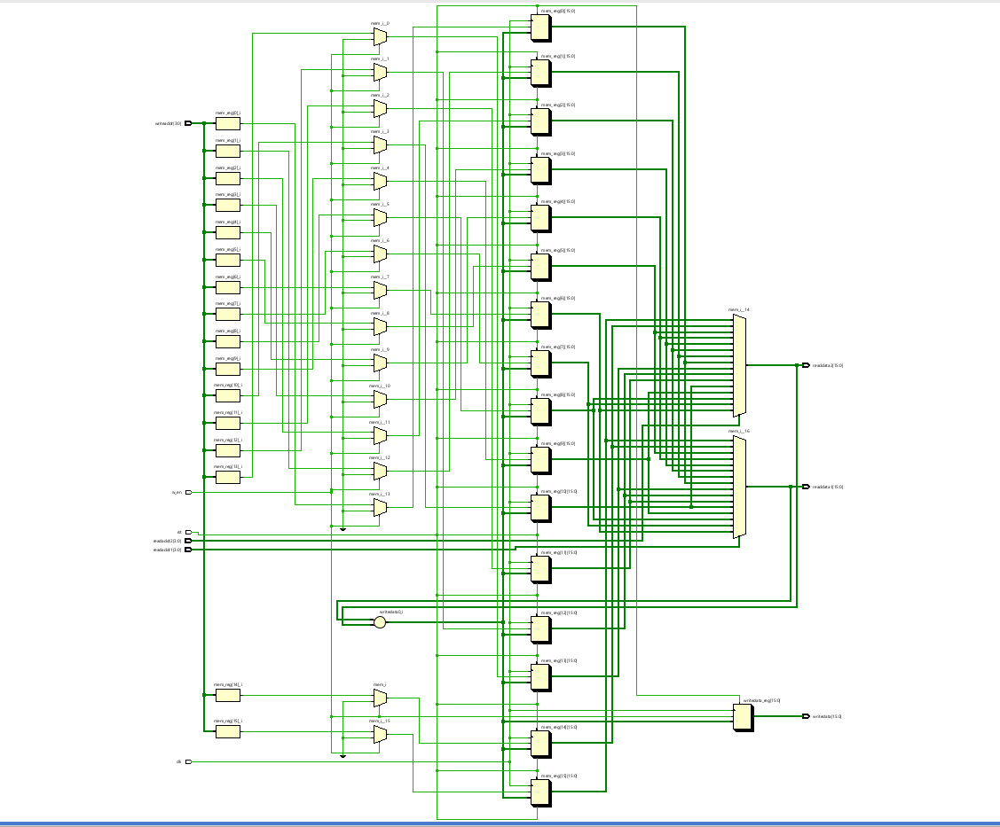
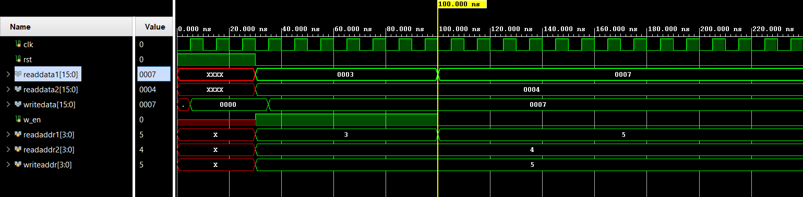

# 📘 Verilog 100 Days – Waveform and Explanation Gallery

This document shows the waveform results and brief explanations of  REGISTER FILE

---

## ✅ Day 54 –   REGISTER FILE

 

**Description:**  
 The schematic of REGISTER FILE
---

### 🔬 Simulation Result

**Description:**  
simulation results of  REGISTER FILE
 

**WORKING** 
Initializes memory after reset

Reads two values from memory

Writes their sum into another location

Reads back the sum

