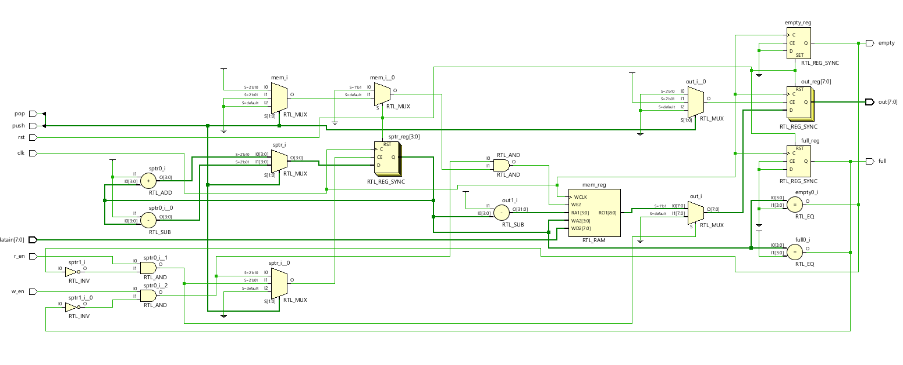
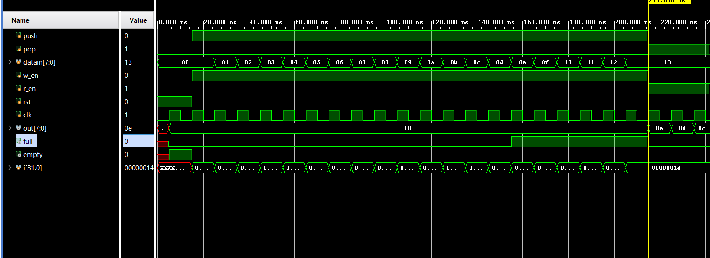
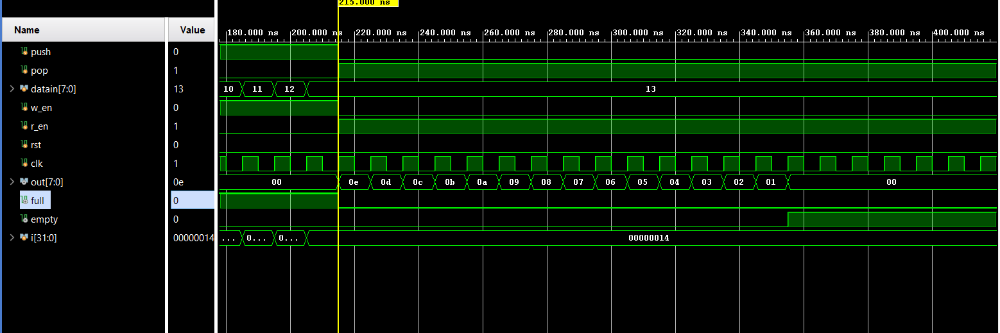

# 📘 Verilog 100 Days – Waveform and Explanation Gallery

This document shows the waveform results and brief explanations of  LIFO

---

## ✅ Day 55 - LIFO
 

**Description:**  
  the scematic of  LIFO 

 
### 🔬 Simulation Result

**Description:**  
simulation results of LIFO-IN
 

**Description:**  
simulation results.
simualtion results of  LIFO-OUT

  
