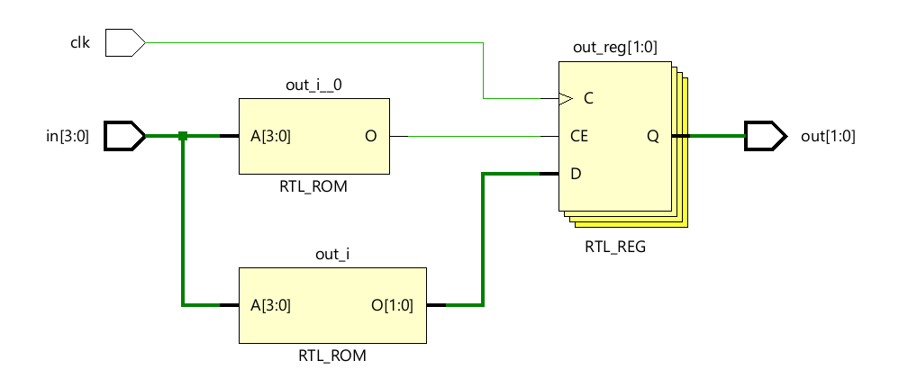
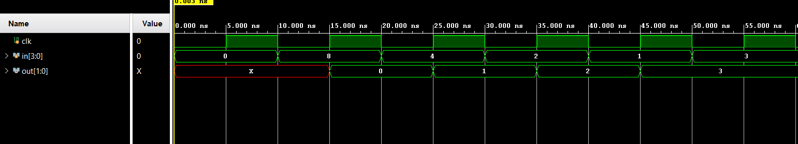

# 📘 Verilog 100 Days – Waveform and Explanation Gallery

This document shows the waveform results and brief explanations of  PRIORITY ENCODER

---

## ✅ Day 57 - PRIORITY ENCODER 

 

**Description:**  
  the scematic of PRIORITY ENCODER  

 
### 🔬 Simulation Result

**Description:**  
simulation results.
simualtion results of PRIORITY ENCODER 

 
 
