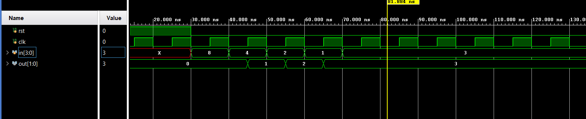

# 📘 Verilog 100 Days – Waveform and Explanation Gallery

This document shows the waveform results and brief explanations of ROTATAORY PRIORITY ENCDOER

---

## ✅ Day 58 -  ROTATAORY PRIORITY ENCDOER

 

**Description:**  
  the scematic of ROTATAORY PRIORITY ENCDOER

 
### 🔬 Simulation Result

**Description:**  
simulation results.
simualtion results of ROTATAORY PRIORITY ENCDOER
 
 
