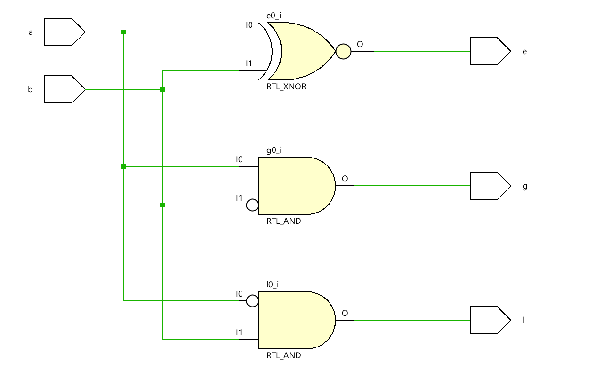
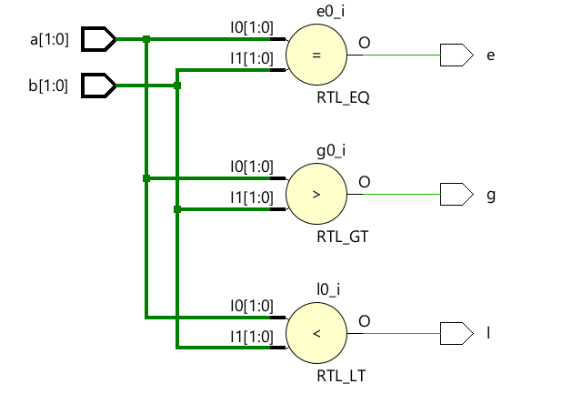
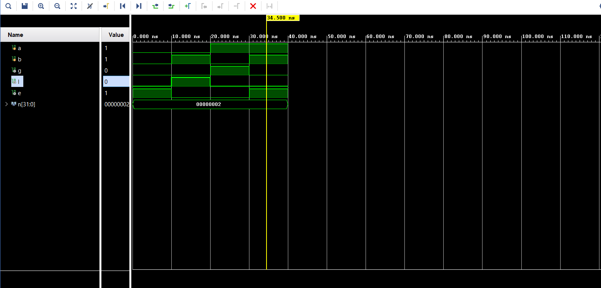
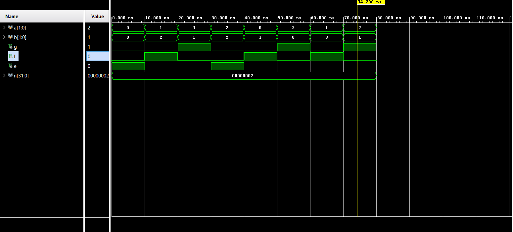

# 📘 Verilog 100 Days – Waveform and Explanation Gallery

This document shows the waveform results and brief explanations of  comparator

---

## ✅ Day 06 - comparator

 

**Description:**  
  the scematic of  comparator for one bit.

###  full Modeling

**Description:** 
  the  scematic for n-bit comparator , here it is for 2-bit. 

### 🔬 Simulation Result

**Description:**  
simulation results.
simualtion results of  one bit comparator.

**Description:**  
simulation results.
simualtion results of 2-bit comparator.
