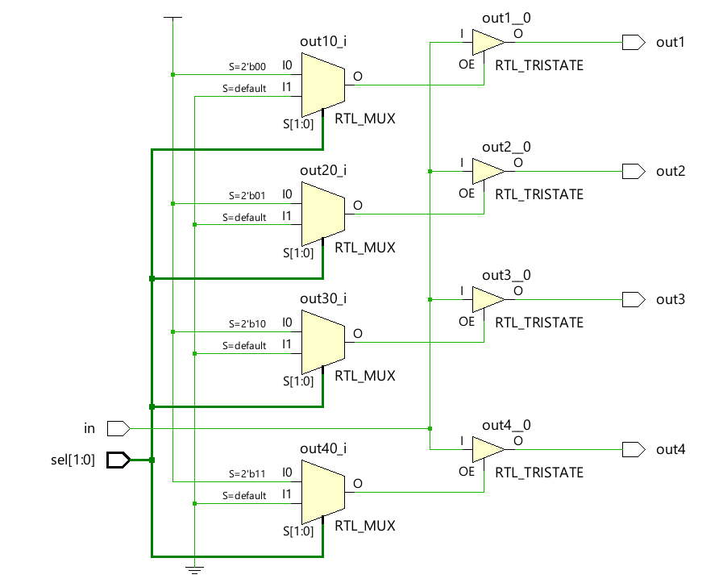
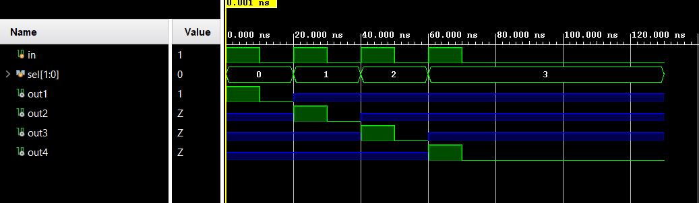

# 📘 Verilog 100 Days – Waveform and Explanation Gallery

This document shows the waveform results and brief explanations of DEMUX TRISTATE
---

## ✅ Day 60 - DEMUX TRISTATE
 

**Description:**  
  the scematic of DEMUX TRISTATE
 
### 🔬 Simulation Result

**Description:**  
simulation results.
simualtion results of DEMUX TRISTATE
 
 
