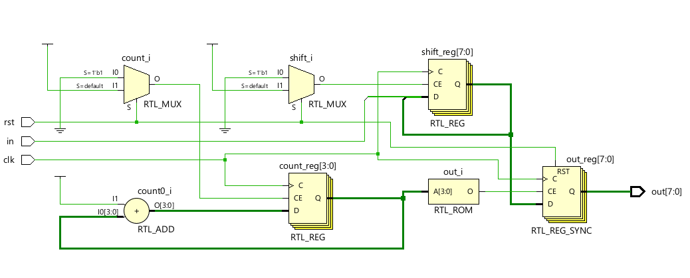
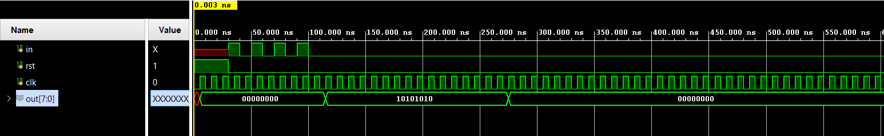

# 📘 Verilog 100 Days – Waveform and Explanation Gallery

This document shows the waveform results and brief explanations of  serial to parallel
---

## ✅ Day 61 -  serial to parallel

 

**Description:**  
  the scematic of serial to parallel

 

### 🔬 Simulation Result

**Description:**  
simulation results - 
simualtion results of serial to parallel
